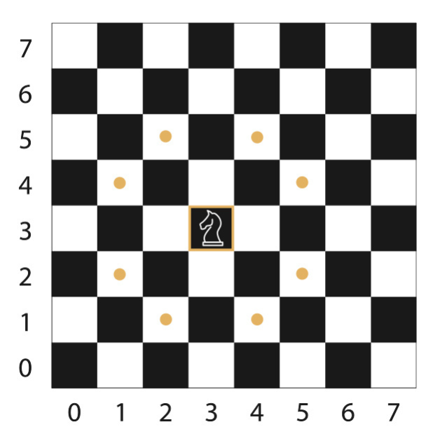
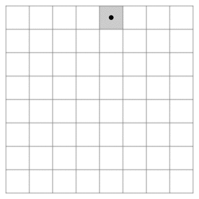

# Knights-Travails

The Knights-Travails problem is a classic problem in computer science, which involves finding the shortest possible path for a knight on a chessboard from one square to another. The knight can move in an L-shape: two squares in one direction and one square perpendicular to that.

The solution to this problem involves using a breadth-first search (BFS) algorithm. BFS is an algorithm for traversing or searching tree or graph data structures. It starts at the tree root (or some arbitrary node of a graph, sometimes referred to as a 'search key') and explores the neighbor nodes at the present depth prior to moving on to nodes at the next depth level.

knight in chess can move to any square on the standard 8x8 chess board from any other square on the board

In the context of this problem, each square on the chessboard is a node, and each valid move for the knight is an edge connecting two nodes. The BFS algorithm is used to find the shortest path from the start square (node) to the finish square (node).
